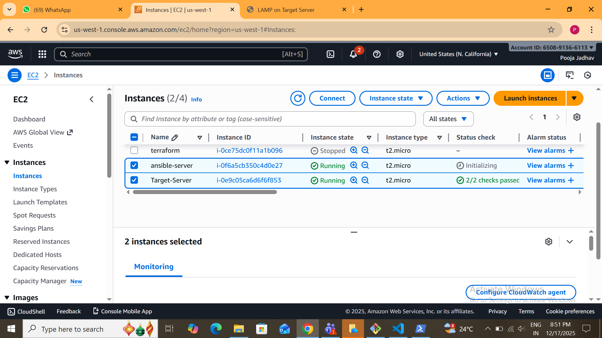
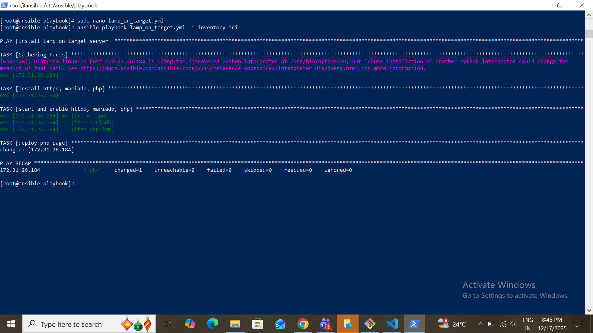
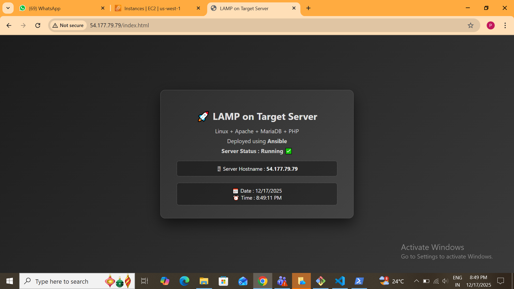

 #  LAMP Deploy index.html on Target Server Using Ansible with Inventory

## Task Statement
Create a LAMP stack on a target server and deploy a custom index.html file using Ansible.

# Overview

This repository contains an Ansible-based automation that installs and configures the LAMP stack (Linux, Apache, MariaDB, PHP) on a remote AWS EC2 instance (target server). After successful installation, a custom index.html page is deployed to verify the setup.

The task demonstrates practical knowledge of remote server automation, configuration management, and Infrastructure as Code (IaC).

# Architecture
- Local Machine: Windows (PowerShell)
- Ansible Control Node: Amazon Linux 2023 EC2
- Target Server: Amazon Linux EC2
- Automation Tool: Ansible
- Connectivity: SSH using PEM key

         Local System
         │
         ├── SCP / SSH
         │
      Ansible Server (Control Node)
         │
         ├── Ansible Playbook
         │
      Target Server
         │
         └── LAMP Stack + index.html

## Project Structure

     LAMP-On-Target-With-Ansible-Inventory/
     │
     ├── inventory.ini
     ├── lamp_on_target.yml
     ├── README.md
     └── Img/
     |_Architecture.png
     ├── instance.png
     ├── run.png
     └── index.html_output.png

## Prerequisites
- Ansible installed on control node
- SSH access to target server using PEM key
- Inventory file configured with target - server details

## What the Playbook Does
- Installs Apache, MariaDB, and PHP packages
- Starts and enables required services
- Deploys a custom index.html file to  Apache web root
- Ensures idempotent and optimized execution

### EC2 Instance 

## How to Run
    ansible-playbook lamp_on_target.yml -i inventory.ini

## Playbook Result

     ok=4
     changed=3
     failed=0
     unreachable=0

This confirms successful execution on the target server.

## Output Verification
- Apache service running on target server
- Web page accessible via Target Server - Public IP
- Custom index page displayed successfully

##  Output

    LAMP on Target Server
    Linux + Apache + MariaDB + PHP
    Deployed using Ansible
    Server Status : Running 

## Key Learnings
- Ansible automation on remote servers
- Inventory-based target management
- Secure SSH connectivity
- LAMP stack deployment using IaC

## Conclusion
This task successfully implements LAMP stack creation and web page deployment on a target server using Ansible. The solution follows clean coding practices and real-world DevOps standards.

## Technology Stack
    AWS EC2 | Linux | Ansible | Apache | MariaDB | PHP | PHP-FPM

## Author
 
 Pooja Jadhav
